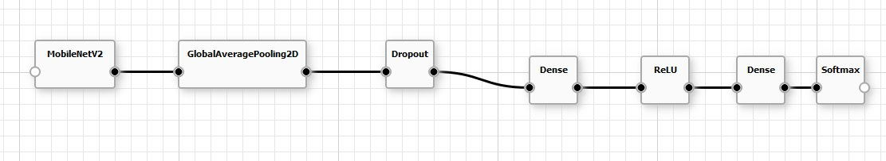
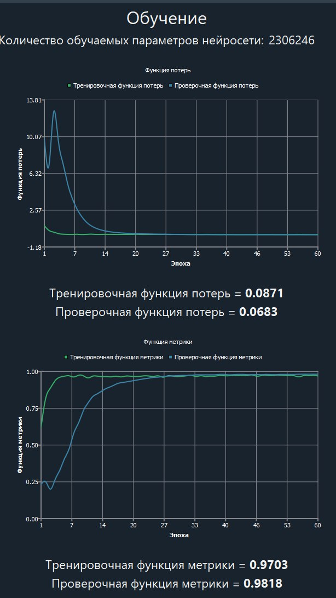
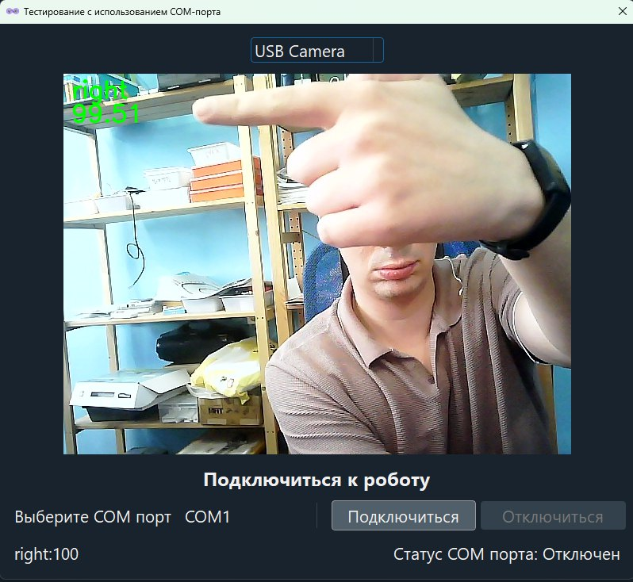

## Модель построена на основе предварительно обученной MobileNetV2. Архитектура последовательна и состоит из следующих слоев:

1. MobileNetV2: Это базовая предварительно обученная сверточная сеть, вероятно, используемая для извлечения признаков из входных изображений.
2. GlobalAveragePooling2D: Этот слой выполняет глобальное усредняющее пулинг на картах признаков, сгенерированных MobileNetV2. Он уменьшает размерность признаков и помогает сделать модель более устойчивой к пространственным сдвигам.
3. Dropout: Включен слой Dropout для предотвращения переобучения путем случайного обнуления части входных элементов при каждом обновлении во время обучения.
4. Dense: Полносвязный (плотный) слой.
5. ReLU: Слой активации, использующий функцию Rectified Linear Unit (ReLU), которая вводит нелинейность в модель.
6. Dense: Еще один полносвязный (плотный) слой.
7. Softmax: Финальный слой активации, обычно используемый для задач многоклассовой классификации, выдающий вероятности для каждого класса.

## Визуальное представление архитектуры модели показано ниже:

# Параметры модели

Общее количество обучаемых параметров в этой нейронной сети составляет 2 306 246.

# Производительность обучения

Модель обучалась в течение 60 эпох. Процесс обучения отслеживался с использованием двух ключевых метрик: функции потерь и общей функции метрики

# Функция потерь

Кривые потерь на тренировочном и валидационном наборах показывают, что потери значительно снижаются на начальных эпохах, а затем стабилизируются, что указывает на эффективное обучение модели.

## Итоговая тренировочная функция потерь: 0.0871
## Итоговая проверочная функция потерь: 0.0683

# Функция метрики

Кривые метрик на тренировочном и валидационном наборах показывают, что производительность модели быстро улучшается на ранних эпохах, а затем выходит на плато, достигая высоких результатов.

## Итоговая тренировочная функция метрики: 0.9703
## Итоговая проверочная функция метрики: 0.9818

# Наблюдения

Проверочная функция потерь немного ниже, чем тренировочная, а проверочная функция метрики немного выше, чем тренировочная. Это говорит о том, что модель хорошо обобщает данные на невидимых данных и не переобучается значительно.

Кривые обучения указывают на стабильный процесс обучения без значительных колебаний на последних эпохах.

# Процесс обучения модели

Модель обучалась в визуальной среде моделирования нейронных сетей NNTrack.

Среда позволяет в no-code режиме создавать архитектуры сверточных нейросетей, обучать их, тестировать и экспортировать в удобном формате.

# Тестирование модели

Ниже представлено видео результатов тестирования модели:

# Взаимодействие нейросети с роботом

В NNTrack есть функция передачи данных тестирования по COM-порту на мк Трекдуино. 

В программе робота прописано, что он реагирует на данные, полученные от нейросети.

